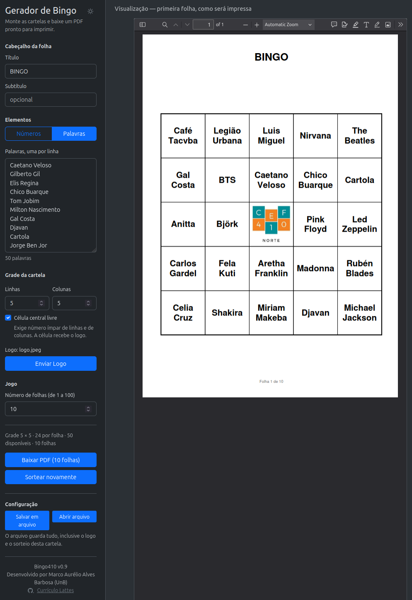

# Bingo410 — gerador de cartelas de bingo

O Bingo410 surgiu de uma demanda real: a professora Maria Farias, da Escola
Classe 410 Norte, usava outro sistema web que não atendia ao que ela precisava —
gerar cartelas de bingo numa interface simples e configurável, que permitisse
personalizá-las com um logo e salvar diversas configurações para uso posterior.

Atividades simples devem ser fáceis de fazer e de refazer.

### 👉 **Acesse neste site: [bingo410.web.app](https://bingo410.web.app)**

<!-- A TELA — seção pronta, esperando o arquivo da imagem.
     Salve o screenshot em `docs/imagens/tela.png` e apague estas duas linhas
     de comentário (esta e a última), deixando o título e a imagem no lugar.

## A tela



-->

## O que você pode fazer

- Cabeçalho configurável.
- Tamanho da grade configurável: customize o tamanho da sua cartela.
- Bingo de números ou de palavras.
- Logo personalizável: a célula central pode ser trocada por um logo.
- Visualização preliminar: você altera o jogo e vê o resultado como será impresso.
- Salve o seu bingo no seu computador: a configuração de cada jogo (inclusive o
  logo) pode ser salva em um arquivo. Compartilhe com seus colegas por e-mail,
  pen-drive, etc. É um joguinho simples, mas muito divertido e útil.
- Não armazenamos nenhum dado de quem monta os bingos!

## Como foi construído

Este sistema foi construído como um exercício de desenvolvimento assistido por
IA: o código foi todo escrito em Python, JavaScript, HTML e CSS usando
**Claude Code**.

O método importa! O trabalho foi organizado em um plano que contém etapas e
subtarefas, cada uma planejada antes de ser escrita e reavaliada depois de
pronta. Como o sistema é relativamente simples e havia apenas um desenvolvedor,
o controle de versão adotou *Trunk Based Development*: depois de estruturar um
plano global, cada tarefa gerou um *commit*, que é um passo no controle de
versões. Cada funcionalidade veio acompanhada de testes automatizados, e o
código Python do backend foi analisado com cuidado.

Ao longo de cada tarefa uma série de decisões foi tomada, e todas ficaram
guardadas em um arquivo específico. Vários problemas apareceram no caminho e
exigiram decisões — automatizadas ou não — registradas em um arquivo markdown,
indicando o porquê de cada uma. Eventualmente foi necessário voltar atrás e
refazer alguma tarefa, e estes arquivos, contendo planejamento, decisões e
armadilhas encontradas, ajudam a máquina a não esbarrar nas mesmas questões nem
a repetir o mesmo erro. Caminhos considerados e descartados também são anotados
nas armadilhas, pois custam tempo de processamento computacional e de análise
humana.

São esses registros que permitem a uma sessão nova retomar o trabalho onde a
anterior parou, sem repetir o diagnóstico anterior.

## Tecnologias utilizadas

| | |
|---|---|
| Backend | Python 3.14, FastAPI, ReportLab, Pillow |
| Frontend | Bootstrap 5 e JavaScript, sem build step |
| Ferramental | uv, ruff, pytest |
| Publicação | Docker, GitHub Actions, Google Cloud Run, Firebase Hosting |

O serviço é *stateless*: cada requisição leva a configuração inteira e recebe
um PDF de volta. Nada é guardado no servidor — nem cadastro, nem cartela, nem
o logo enviado.

## Quer rodar esse código localmente?

```bash
uv sync
uv run uvicorn bingo.api:app --reload --host 0.0.0.0
```

A página fica em `http://localhost:8000`.

## Licença e contribuições

Software livre sob licença MIT. Caso queira trabalhar neste projeto, faça um
fork. Qualquer dúvida, entre em contato pelo GitHub.

## Autoria

Marco Aurélio Alves Barbosa (UnB) —
[GitHub](https://github.com/aureliobarbosa) ·
[Currículo Lattes](https://lattes.cnpq.br/5720622055548812)
